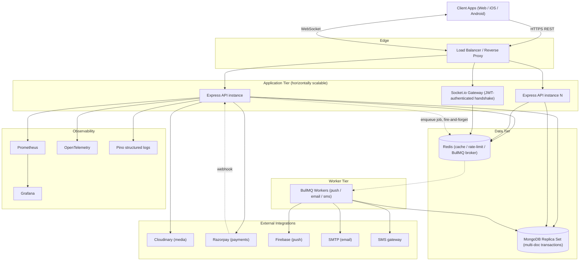
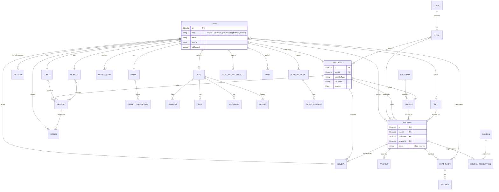

# Architecture

Patmypets is a modular monolith: one Express application and one BullMQ worker
process, sharing a single MongoDB replica set and Redis instance, structured
internally as a set of independent feature modules so it can be split into
services later without a rewrite.

## Layered design

Every module under `src/modules/<name>/` follows the same internal layering
(Clean Architecture / Repository Pattern):

```
routes.ts        Express router + Zod validation wiring + Swagger JSDoc
  -> controller.ts   HTTP concerns only: parse req, call service, shape response
    -> service.ts       Business logic, orchestration, transactions
      -> repository.ts     Mongoose queries, isolates the data layer
        -> schema.ts          Mongoose schema/model definition
validators.ts     Zod request schemas (source of truth for request shapes)
dto.ts            Types inferred from validators (no duplicate type defs)
mapper.ts         Converts Mongoose documents to public-safe response DTOs
constants.ts      Enums, model names, magic numbers
types.ts          Domain interfaces (I<Entity>) and HydratedDocument aliases
```

Controllers never touch Mongoose directly; services never touch `req`/`res`;
repositories are the only layer that imports a Mongoose model. Cross-module
calls go through another module's `service`, never its `repository`.

## Request flow



Key production-safety decisions baked into this flow:

- **Job enqueue is fire-and-forget.** `notificationService.notify()` never
  `await`s the BullMQ `.add()` call on the request path — a down/slow Redis
  degrades push/email/SMS delivery, not booking/payment/signup latency.
- **MongoDB runs as a (single-node in dev, multi-node in prod) replica set**
  because the wallet ledger and order placement use multi-document ACID
  transactions (`session.withTransaction()`).
- **Razorpay webhooks** are verified against the raw request body (captured
  before `express.json()` parses it) using `RAZORPAY_WEBHOOK_SECRET`.
- **Refresh tokens rotate on every use** and are stored bcrypt-hashed; reuse
  of an already-rotated token revokes every session for that user (stolen
  refresh-token detection).

## Data model

Three roles share one `User` collection (`role: USER | SERVICE_PROVIDER |
SUPER_ADMIN`); a `SERVICE_PROVIDER` additionally owns one `Provider` document
carrying a `providerType` enum (VET, GROOMER, BOARDING, PET_WALKER, TRAINER,
CLEANER, PHARMACY, RELOCATION, OTHER) instead of splitting into per-vertical
tables.



`FeatureFlag`, `Setting`, `Banner`, `AuditLog`, and `Otp` are standalone
collections with no foreign keys (key-value/log resources) and are omitted
above for readability.

## Module map

| Domain | Modules |
|---|---|
| Identity | `auth`, `users`, `admin` |
| Marketplace core | `providers`, `services`, `categories`, `zones` (cities + zones) |
| Booking | `bookings`, `availability`, `reviews` |
| Commerce | `wallet`, `coupons`, `payments`, `marketplace` (products, cart, wishlist, orders) |
| Engagement | `notifications`, `chat`, `community` (posts/comments/likes/bookmarks/reports), `blogs` |
| Support | `support`, `lost-and-found` |
| Platform | `pets`, `uploads`, `search`, `analytics` |

## Background jobs

`src/worker.ts` runs the BullMQ workers (`src/common/jobs/`) as a separate
process from the API (`src/server.ts`), so a burst of notification jobs never
competes with the API's event loop. Both processes share the same MongoDB and
Redis connections and can be scaled independently.

## Observability

- **Metrics**: `prom-client` exposes `/metrics`; `docker/prometheus.yml`
  scrapes it; Grafana is wired to Prometheus as a data source.
- **Tracing**: OpenTelemetry auto-instrumentation exports OTLP traces
  (`OTEL_EXPORTER_OTLP_ENDPOINT`).
- **Logs**: Pino structured JSON logs (pretty-printed only in development),
  with request IDs threaded through via `x-request-id`.
